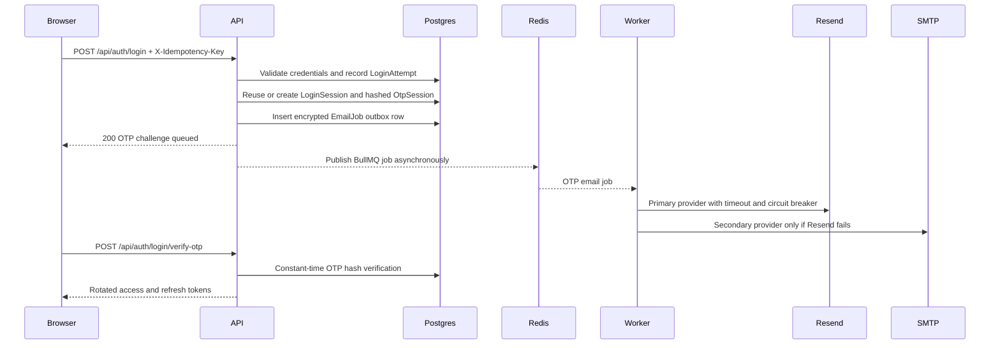

# Authentication Architecture

## Request flow



The database outbox is the durable handoff. Redis accelerates distribution across workers, but a Redis outage does not lose the email request. Without Redis, one API process polls the outbox as a development fallback.

## Backend layout

```text
src/
  models/emailJob.model.js
  models/loginAttempt.model.js
  models/loginSession.model.js
  models/otpSession.model.js
  models/passwordHistory.model.js
  services/email/emailProviders.js
  services/email/emailQueue.js
  services/email/templates.js
  services/otpService.js
  services/passwordHistoryService.js
  shared/middleware/authRateLimits.js
  shared/middleware/csrfProtection.js
  shared/middleware/errorMiddleware.js
```

## Controls

| Endpoint | Limit | Key |
| --- | --- | --- |
| Login | 10 per 15 minutes | IP + normalized email |
| OTP verification | 10 per 10 minutes | IP + normalized email |
| OTP resend | 3 per minute | IP + normalized email |
| Password reset | 3 per hour | IP + normalized email |

Redis stores rate-limit counters when `REDIS_URL` or `UPSTASH_REDIS_URL` is configured. Login reuses an active pending challenge for the same user and device. The browser also holds a stable idempotency key for the OTP session lifetime.

## Production environment

```text
FIREBASE_PROJECT_ID
FIREBASE_CLIENT_EMAIL
FIREBASE_PRIVATE_KEY
JWT_SECRET
JWT_REFRESH_SECRET
OTP_HASH_SECRET
EMAIL_JOB_ENCRYPTION_KEY
REDIS_URL
FRONTEND_URL
CORS_ORIGIN
RESEND_API_KEY
RESEND_FROM_EMAIL=AYEDOS SACCO <auth@mail.ayedos.com>
```

Recommended SMTP fallback:

```text
SMTP_HOST
SMTP_PORT
SMTP_USER
SMTP_PASS
SMTP_FROM_EMAIL
```

For larger volume, run `startEmailWorkers()` in dedicated worker replicas and scale independently from the API.

## Live email delivery checklist

1. Verify a sending subdomain such as `mail.ayedos.com` in Resend and publish its SPF and DKIM records.
2. Set `RESEND_FROM_EMAIL` to an address on that verified domain. Do not use `onboarding@resend.dev` for members.
3. Add a DMARC record after SPF and DKIM are verified.
4. Inspect Resend events for `sent`, `delivered`, `delivery_delayed`, `bounced`, and `complained`.
5. Check suppressions for previously bounced or complained recipient addresses.
6. Alert on `EmailJobs.status = FAILED`, queue failures, provider circuit opening, and outbox age.

## Security checklist

- OTP values are HMAC hashed and never stored in plaintext.
- Email job payloads are AES-GCM encrypted at rest.
- Refresh tokens rotate and are matched against a server-side session hash.
- Active sessions are device tracked and revocable.
- Account lockout, Helmet, secure cookies, CSRF checks, request IDs, structured logs, and audit persistence are enabled.
- Provider failures, SQL details, and stack traces are not exposed in production responses.
- Password changes reject recently used password hashes.

## Deployment checklist

- Provision Postgres and Redis before rollout.
- Apply the new tables and login-session columns before enabling the new login route.
- Use secrets with at least 32 random bytes and rotate any previously exposed values.
- Keep `DB_SYNC_ON_START=false` after managed migrations are established.
- Alert on `/ready`, queue backlog, failed email jobs, login failure spikes, and rate-limit spikes.
- Export structured logs to the production monitoring platform.
- Exercise login, resend, verification, refresh rotation, logout, password reset, Redis interruption, Resend interruption, and SMTP fallback in staging.
